이 글은 [포스트](https://siboehm.com/articles/22/CUDA-MMM)를  참고하며 직접 커널과 그림을 작성하며 진행한 공부이다.

CUDA는 cuBLAS에서 최적화된 GEMM api를 제공한다. 직접 작성한 커널도 최적화를 통해서 충분히 cuBLAS 급의 성능을 낼 수 있다. 단계적으로 CUDA의 최적화 개념들을 적용하면서 따라가보자.

- A: (M, K), row-major
- B: (K, N), row-major
- C: (M, N), row-major
- DRAM: Global memory
- SRAM: Shared memory

구현은 다음과 같고, 결과를 먼저 보이면 아래와 같다.

0. Naive implementation, DRAM coalescing
1. SRAM caching
2. SRAM 1d tiling
3. SRAM 2d tiling
4. Vectorized SRAM 2d tiling
5. Warp tiling

```
[BENCHMARK]                    CUBLAS GEMM │ 0.045334 ms (w:10 r:20)
[BENCHMARK]               GPU GEMM 0 NAIVE │ 3.943722 ms (w:10 r:20) [PASSED]
[BENCHMARK]     GPU GEMM 0 DRAM COALESCING │ 0.517949 ms (w:10 r:20) [PASSED]
[BENCHMARK]        GPU GEMM 1 SRAM CACHING │ 0.248670 ms (w:10 r:20) [PASSED]
[BENCHMARK]      GPU GEMM 2 SRAM 1D TILING │ 0.249046 ms (w:10 r:20) [PASSED]
```

## 0. Naive implementation

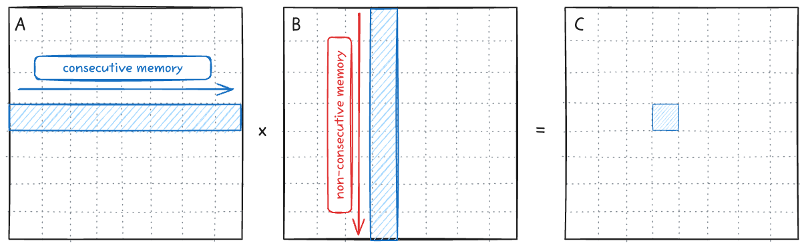

가장 기본형태의 연산은 다음과 같이 한개의 스레드가 C의 한 element를 계산하기 위한 연산을 진행하는 것이다. Row-major이기 때문에 B를 load할 때 불연속적인 메모리를 읽어오는 단점이 있다. 이 동작을 warp-level에서의 GEMM operation을 나타내면 아래 그림과 같다.

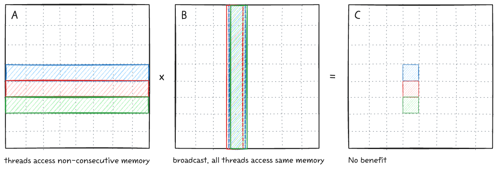

Loop 구조상 A를 load할 때 스레드들은 비연속적인 column 메모리에 접근하기에 memory coalescing이 불가능하다. Memory coalescing이 불가능하면 결국 warp 내에서 load operation이 32번 발생하게 되고, 이는 성능 크나큰 성능 저하를 가져온다. 

B를 load할 때는 모든 스레드가 같은 값에 접근하기 때문에 warp 내의 broadcast가 동작한다. 하지만 결과적으로 보면 이 스레드들을 하나의 워프로 묶는건 이점이 없다.

### DRAM coalescing

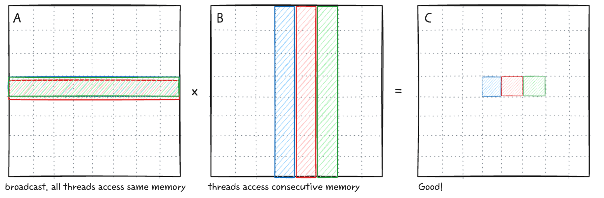

위와 같이 연속적인 메모리를 접근하여서 워프의 이점을 살려야한다. A를 load할때는 memory load - broadcast를 통해서 필요한 모든 데이터가 채워진다. B의 값을 load할때 warp내에서는 인접한 연속적인 메모리를 한번에 불러오므로 memory coalescing이 가능하다.

```cpp
__global__ void gemm_gpu_0_naive(int M, int N, int K, float alpha, float *A, float *B, float beta, float *C)
{
  int tid = blockIdx.x * blockDim.x + threadIdx.x;
  int row = tid % N;
  int col = tid / N;
 ...
}

__global__ void gemm_gpu_0_dram_coalescing(int M, int N, int K, float alpha, float *A, float *B, float beta, float *C)
{
  int tid = blockIdx.x * blockDim.x + threadIdx.x;
  int row = tid / N;
  int col = tid % N;
  ...
}
```

두 커널의 코드 차이는 row, col의 계산방식 뿐이지만 실제 성능은 큰 차이가 난다. 프로파일링의 결과를 보면 성능 차이가 DRAM operation에서 발생하는 것을 확인할 수 있다.

```bash
# RTX 5090
$ sudo /usr/local/cuda/bin/ncu --metrics dram__bytes.sum.per_second gemm
  gemm_gpu_0_naive(int, int, int, float, float *, float *, float, float *) (4096, 1, 1)x(256, 1, 1), Context 1, Stream 7, Device 0, CC 12.0
    Section: Command line profiler metrics
    -------------------------- ----------- ------------
    Metric Name                Metric Unit Metric Value
    -------------------------- ----------- ------------
    dram__bytes.sum.per_second     Gbyte/s         2.40
    -------------------------- ----------- ------------

  gemm_gpu_0_dram_coalescing(int, int, int, float, float *, float *, float, float *) (4096, 1, 1)x(256, 1, 1), Context 1, Stream 7, Device 0, CC 12.0
    Section: Command line profiler metrics
    -------------------------- ----------- ------------
    Metric Name                Metric Unit Metric Value
    -------------------------- ----------- ------------
    dram__bytes.sum.per_second     Gbyte/s        18.07
    -------------------------- ----------- ------------
```

## 1. SRAM caching
Naive 구현체는 데이터를 반복해서 가져와야하는데, DRAM에서 여러번 가져오는 것은 성능적 손실이 크다. [Paper](https://arxiv.org/abs/1804.06826)에 따르면 V100 기준으로 DRAM bandwidth는 900 GB/s, SRAM bandwidth는 13,800 GB/s 이다 (SRAM bandwidth는 공식적으로 수치가 알려져있지는 않다). SRAM을 활용, 메모리를 최대한 재사용해서 성능을 올려보자. 

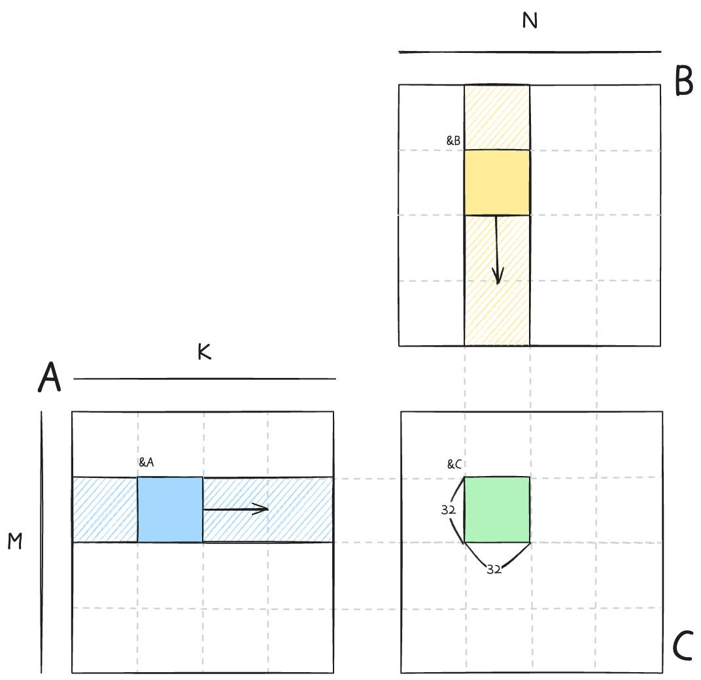

각 블록은 32x32 크기를 가지고 C의 결과값을 하나씩 담당해서 연산을 한다. 각 블록에서 필요로 하는 DRAM의 메모리는 위 그림의 빗금친 영역이다. bkIdx loop를 통해서 SRAM에 store할 영역으로 이동하고, tIter loop를 통해서 SRAM load - gemm 연산을 수행한다. 1 result per thread 이므로 결과값은 단일 변수 `sum` 에 누적해서 최종적으로 DRAM C에 저장한다.

```cpp
template <int BLOCKSIZE>
__global__ void gemm_gpu_1_sram_caching(int M, int N, int K, float alpha, float *A, float *B, float beta, float *C)
{
    int bkRow = blockIdx.y;
    int bkCol = blockIdx.x;

    A += K * BLOCKSIZE * bkRow;
    B += BLOCKSIZE * bkCol;
    C += N * BLOCKSIZE * bkRow + BLOCKSIZE * bkCol;

    __shared__ float sA[BLOCKSIZE * BLOCKSIZE];
    __shared__ float sB[BLOCKSIZE * BLOCKSIZE];

    int tRow = threadIdx.x / BLOCKSIZE;
    int tCol = threadIdx.x % BLOCKSIZE;

    float sum = 0.0f;
    for (int bkIdx = 0; bkIdx < K; bkIdx += BLOCKSIZE)
    {
        sA[threadIdx.x] = A[tRow * K + tCol];
        sB[threadIdx.x] = B[tRow * N + tCol];
        __syncthreads();

        A += BLOCKSIZE;
        B += BLOCKSIZE * N;
        
        for (int tIter = 0; tIter < BLOCKSIZE; tIter++)
        {
            sum += sA[tRow * BLOCKSIZE + tIter] * sB[tIter * BLOCKSIZE + tCol];
        }
        __syncthreads();
    }

    C[tRow * N + tCol] = alpha * sum + beta * C[tRow * N + tCol];
}
```

## 2. SRAM 1D tiling
SRAM caching을 활용함으로써 성능이 향상되었지만 여전히 cuBLAS의 커널에 비해서는 부족하다. 단순하게 1개의 스레드가 1개의 결과를 만들어내는 `SRAM caching` 커널의 메모리 접근 패턴을 보면 다음과 같다.  즉, C 행렬 원소 한 개의 결과값을 만들기 위해서는 `K/16 DRAM`, `K*2 SRAM` 만큼의 메모리 접근이 필요한 것이다.

- DRAM: K/32 iterations of outer loop * 2 loads
- SRAM: K/32 iterations of outer loop * BLOCKSIZE (=32) * 2 loads
- Memory accesses per result: K / 16 DRAM, K * 2 SRAM

프로파일링 결과를 보면 MIO (Memory Input/Output) 에서 warp stall이 발생하고, 이로 인해 성능이 저하됨을 알 수 있다.

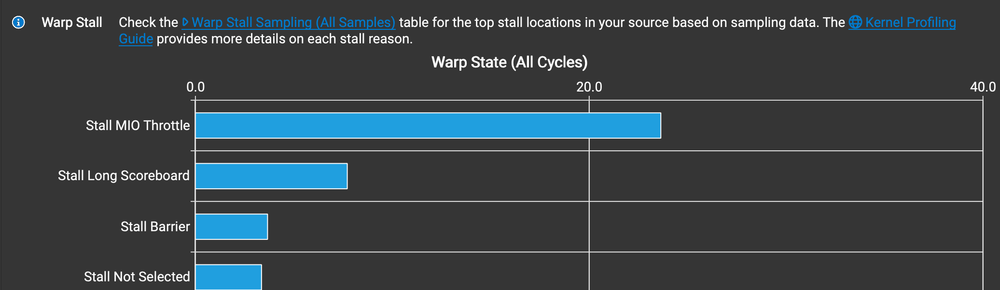

이 문제는 동일한 메모리를 재활용하는 것으로 해결이 가능하다. 1개의 스레드가 8개의 element의 output을 만들어내게끔 타일링을 하면 다음과 같다.

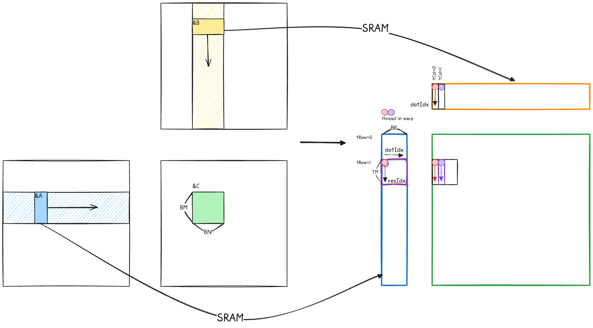

Warp 내에서 하나의 스레드는 column 방향으로 C matrix의 8개의 원소를 계산하게 구현하고, 이를 바탕으로 아까의 메모리 식을 다시 계산해보면,

- DRAM: K/8 iters (dotIdx) loop * 2 loads
- SRAM: K/8 iters (dotIdx) loop * BK(=8) * (1 + TM(=8))
- Memory accesses per result: K/32 DRAM, K * 9/8 SRAM

 `K/16 -> K/32 DRAM`, `K*2 -> K*9/8 SRAM` 으로, 결과 한개당 메모리접근이 줄어들게 된다.

```cpp
for (int bkIdx = 0; bkIdx < K; bkIdx += BK)
{
    sA[innerRowA * BK + innerColA] = A[innerRowA * K + innerColA];
    sB[innerRowB * BN + innerColB] = B[innerRowB * N + innerRowB];
    __syncthreads();

    A += BK;
    B += BK * N;

    for (int dotIdx = 0; dotIdx < BK; dotIdx++)
    {
        float _b = sB[dotIdx * BN + tCol];
        for (int resIdx = 0; resIdx < TM; resIdx++)
        {
            sum[resIdx] += sA[(tRow * TM + resIdx) * BK + dotIdx] * _b;
        }
    }
    __syncthreads();
}
```

이 커널에서는 BM와 TM의 사이즈가 동일해야 한다. 한 블록의 스레드 개수는 (BM*BN/TM)개인데, 이 스레드 개수와 sA, sB의 사이즈가 동일해야 DRAM->SRAM 을 손쉽게 수행할 수 있기 때문이다.

```cpp 
sA[innerRowA * BK + innerColA] = A[innerRowA * K + innerColA];
sB[innerRowB * BN + innerColB] = B[innerRowB * N + innerRowB];
```

## Arithmetic Intensity (AI)
Arithmetic intensity, 산술강도는 연산량/메모리량, ops/byte(mem) 으로 나타낸다. 즉 AI가 높을수록 동일한 메모리로 더 많은 연산을 할 수 있음을 의미한다. 이전 챕터에서는 SRAM (Shared memory of CUDA), 1d tiling 을 활용해서 성능을 끌어올렸다. 한개의 스레드에서 아래와 같이 여러개의 결과를 만들어낸다. 살펴본 경우와 더불어 확장된 알고리즘의 AI를 생각해보자.

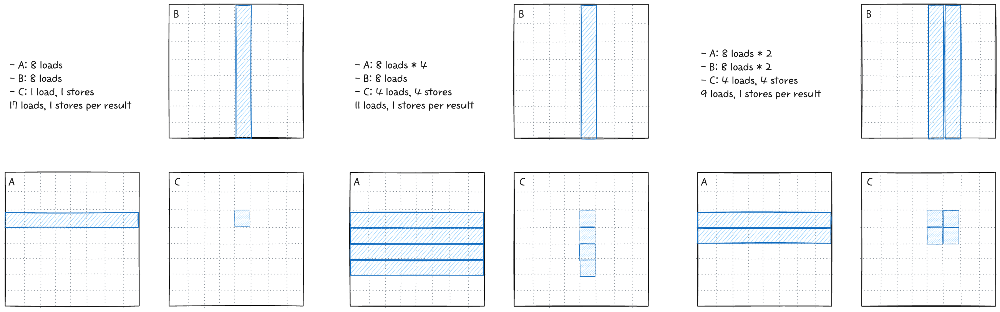

앞서 살펴본 커널에서, 한개의 결과만 만들어내는 경우는 17 load 가 필요하다. 반면 1d tiling을 하는것만으로도 11 load 로 줄어들게 되는데, 2d tiling을 하게 되면 9 load로 그보다 더 줄어든다. 이는 GEMM 연산의 특징으로 메모리를 재사용하는 방향으로 최적화를 더 진행해야됨을 알 수 있다.

## 3. SRAM 2d tilling
2d tiling이 더욱 효과적인 것을 알았으니 이제 구현해보자. `TN` 변수를 추가해서 loop를 확장한다.

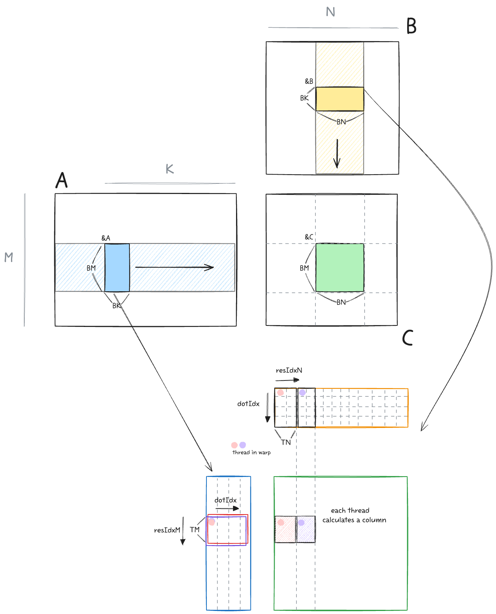

```cpp
  int totalResultsBlocktile = BM * BN;  // 128*128=16384
  int numThreadsBlocktile = totalResultsBlocktile / (TM * TN);  // 16384/(8*8)=256
  int strideA = numThreadsBlocktile / BK;  // 256/8=32

  for (int bkIdx = 0; bkIdx < K; bkIdx += BK) {
    for (int offset = 0; offset < BM; offset += strideA) {
      A_shared[(innerRowA + offset) * BK + innerColA] =
          A[(innerRowA + offset) * K + innerColA];
    }
    for (int offset = 0; offset < BK; offset += strideB) {
      B_shared[(innerRowB + offset) * BN + innerColB] =
          B[(innerRowB + offset) * N + innerColB];
    }
    __syncthreads();

    A += BK;
    B += BK * N;

    for (int dotIdx = 0; dotIdx < BK; dotIdx++) {
      for (int i = 0; i < TM; i++) {
        regM[i] = A_shared[(threadRow * TM + i) * BK + dotIdx];
      }
      for (int i = 0; i < TN; i++) {
        regN[i] = B_shared[dotIdx * BN + threadCol * TN + i];
      }
      for (int resIdxM = 0; resIdxM < TM; resIdxM++) {
        for (int resIdxN = 0; resIdxN < TN; resIdxN++) {
          threadResults[resIdxM * TN + resIdxN] +=
              regM[resIdxM] * regN[resIdxN];
        }
      }
    }
    __syncthreads();
  }
```

BM=BN=128, BK=TM=TN=8로 아래와 같이 커널을 실행시킨다. 한 블록당 스레드는 256개이다.
```cpp
template <int BM, int BN, int BK, int TM, int TN>
void launch_gpu_kernel_4(float *A, float *B, float *C, int M, int N, int K) {
  dim3 block((BM * BN) / (TM * TN));
  dim3 grid(ceil_div(N, BN), ceil_div(M, BM));
  gemm_gpu_4_sram_2d_tiling<BM, BN, BK, TM, TN>
      <<<grid, block>>>(A, B, C, M, N, K);
}
```

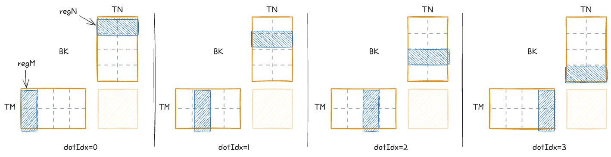

dotIdx를 loop unrolling 하면 위와 같이 생겼다. 우리는 총 16 SRAM load 만 하면 된다.

- DRAM: K/8 iters * 2 (=A+B) * 4 (=sizeSRAM/numThreads) loads
- SRAM: K/8 iters * 8 (=dotIdx) * 2 (=A+B) * 8 (=TM,=TN) loads
- Memory accesses per result: K/64 DRAM, K/4 SRAM

## 4. Vectorized SRAM 2d tiling
GPU에서, SRAM을 load 하는 명령어 `LDS`는 128비트까지 지원 가능하다. 이 이야기는 즉, 위의 2d-tiling 커널에서 A를 전치시키면 한번에 보다 많은 데이터를 효율적으로 읽어올 수 있다는 뜻이다. `LDS.128` 명령어를 활용하기 위해서 A를 전치시키자. 그럼 우리가 이미 B를 불러올 때 하던 것처럼 모양이 나온다.

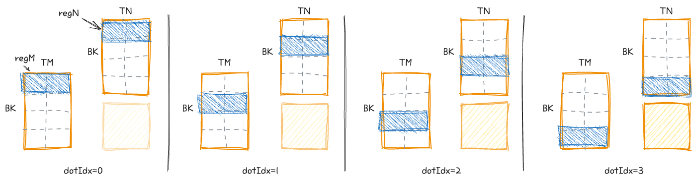

`float4` 벡터 자료형을 이용하면, 128비트 명령어로 대체되고, 성능이 빨라진다.

```cpp
float4 tmp =
    reinterpret_cast<float4 *>(&A[innerRowA * K + innerColA * 4])[0];
// transpose A during the GMEM to SMEM transfer
As[(innerColA * 4 + 0) * BM + innerRowA] = tmp.x;
As[(innerColA * 4 + 1) * BM + innerRowA] = tmp.y;
As[(innerColA * 4 + 2) * BM + innerRowA] = tmp.z;
As[(innerColA * 4 + 3) * BM + innerRowA] = tmp.w;

reinterpret_cast<float4 *>(&Bs[innerRowB * BN + innerColB * 4])[0] =
    reinterpret_cast<float4 *>(&B[innerRowB * N + innerColB * 4])[0];
__syncthreads();
```

## 5. Warp Tiling

지난 섹션에서는 `Vectorized SRAM 2D Tiling` 까지 진행했다. 128비트를 한번에 로드하는 명령어를 이용함과 동시에 DRAM->SRAM 과정에서 A를 Transpose 함으로써 warp내의 데이터 접근 효율을 높였다. 하지만 결국 thread 단위의 tiling 로직에는 한계가 존재하는데, 이러한 연유로 많은 커널들이 warp level tiling을 하게 된다.

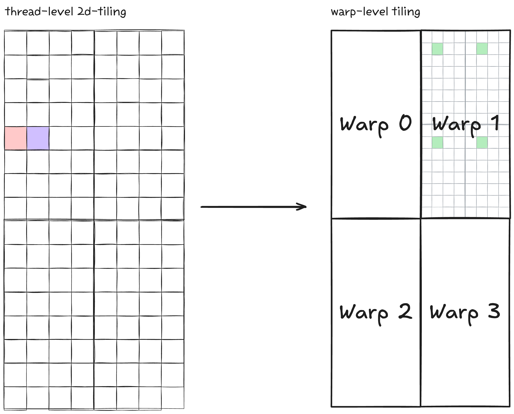

thread-level 2d tiling 커널의 로직을 정리하면 다음과 같다.
- shared memory 캐싱 (`sA`, `sB`)
- `float4` Vectorized load/store
- A를 global->shared 이동 시 transpose하여 계산 접근 패턴 개선

블록 파라미터는 고정값으로:
- `BM=64`, `BN=128`, `BK=16`
- `TM=16`, `TN=4`
- `blockDim.x = (BM*BN)/(TM*TN) = 128`

블록 하나가 `64x128` C 타일을 계산하고 thread 하나는 `16x4` 조각을 담당한다. (SM 내부에는 warp scheduler가 4개가 존재하기 때문에 thread는 128개 이상으로 잡는게 좋다.) 

Thread index를 바로 `tRow`, `tCol`로 변환해 블록 전체 타일을 나눈다.
- `int tRow = threadIdx.x / (BN / TN);`
- `int tCol = threadIdx.x % (BN / TN);`

이 구조는 동작은 단순하지만, warp가 어떤 서브타일을 책임지는지 명시적이지 않다. 결과적으로 warp 단위 데이터/계산 재사용을 설계적으로 통제하기 어렵다.

대부분의 GEMM 연산은 warp-level tiling을 기반으로 하며, 이에 대한 그림을 CUTLASS에서 제공한다. 이를 좀 더 알기 쉽게 주석을 조금 추가한 게 다음 그림이다.


C 타일을 warp-level로 나누고 warp 내부에서 각 스레드는 정해진 구역을 계산하도록 통제함으로써 연산 효율을 올리는 것이다.

실제 코드를 돌려보면 다음과 같은 성능 차이가 난다.

```bash
$ ./src/cuda/gemm/gemm 
Matrix dimensions: M=1024, N=1024, K=1024
[BENCHMARK]                              CUBLAS GEMM │ 0.045798 ms (w:10 r:20)
[BENCHMARK]         GEMM 4 VECTORIZED SRAM 2D TILING │ 0.099450 ms (w:10 r:20) [PASSED]
[BENCHMARK]                       GEMM 5 WARP TILING │ 0.082891 ms (w:10 r:20) [PASSED]
```

## Arithmetic Intensity (AI) 비교

thread-level과 warp-level을 비교해보자.

비교 전제:
- 공통 블록 타일: `BM=64`, `BN=128`, `BK=16`
- `thread-level tiling`: `TM=16`, `TN=4`, `blockDim=128`
- `warp-level tiling`: `TM=4`, `TN=4`, `numWarps=4`, `numThreads=128`
- `warp-level` 유도값: `WM=32`, `WN=64`, `WNITER=2`, `WMITER=2`
- 기본 정의: FMA 1개 = 2 FLOPs, `float` 1개 = 4 Bytes


### 1) DRAM 기준 AI

- FLOPs: `2 * BM * BN * BK`
- DRAM bytes: `4 * (BM*BK + BK*BN)`
- 식: `AI_dram_tile = (2*BM*BN*BK) / (4*(BM*BK + BK*BN))`

값 대입:
- FLOPs = `2*64*128*16 = 262,144`
- Bytes = `4*(64*16 + 16*128) = 12,288`
- AI = `262,144 / 12,288 = 21.333... FLOP/Byte`

| 커널         | DRAM AI (tile) |
| ------------ | -------------- |
| thread-level | `21.33`        |
| warp-level   | `21.33`        |

동일한 블록 타일과 A/B 로딩량을 쓰기 때문에 값이 같다. 이는 전체 C를 포함해서, 블록 전체에서 계산해도 동일한 값이 나온다.

### 2) SMEM/레지스터 메인루프 기준 AI
차이가 나는 부분은 SMEM 활용부분이다.
`dotIdx` 루프에서 `As/Bs -> reg` 로드 후 FMA 누적 구간만 본다.

| 항목 (`dotIdx` 1회, thread당) | thread-level            | warp-level             |
| ----------------------------- | ----------------------- | ---------------------- |
| SMEM read floats              | `regM 16 + regN 4 = 20` | `regA 8 + regB 8 = 16` |
| SMEM read bytes               | `80` Bytes              | `64` Bytes             |
| FLOPs                         | `64 FMA = 128 FLOPs`    | `64 FMA = 128 FLOPs`   |
| AI                            | `128 / 80 = 1.60`       | `128 / 64 = 2.00`      |

BK 전체로 계산해도 동일 비율이 유지된다.
- `thread-level`: `2048 / 1280 = 1.60`
- `warp-level`: `2048 / 1024 = 2.00`

### 3) 결론

- DRAM AI는 두 커널이 사실상 같다.
- 성능 차이는 주로 메인루프 내부 데이터 재사용에서 발생한다.
- warp-level tiling은 thread당 SMEM read를 `80B -> 64B`로 줄여 AI를 `1.60 -> 2.00`으로 높인다.

즉, warp-level tiling에서는 보다 세밀한 제어를 통해서 성능을 올리는 것이다.

## 그 다음은?
- Ampere 부터는 DRAM -> SMEM memcpy / computation 을 asynchronous 하게 진행할 수 있다. 이를 이용한 double-buffering을 통해서 보다 성능을 높일 수 있다. 
- 이번 warp-tiling은 일반화된 최적화커널이 아닌 특정 MNK 사이즈에 대해서 최적화된 커널로 볼 수 있다. 실제로 cuBLAS는 사이즈에 따라 미리 정의해둔 수많은 커널들중에서 최적의 커널을 사용한다. 이러한 auto tuning 또한 중요하다.
- FP32 는 텐서코어 MMA 연산을 지원하지 않는 대신 TF32를 지원한다. Mantissa가 23 bits -> 10 bits 로 줄어들지만, 연산 속도는 훨씬 빨라질 수 있다.
- FP32가 아닌 보다 낮은 정밀도의 데이터타입 (BF16/FP16/NVFP4/...) 을 활용하여 tensor core를 활용하는 방향이 있다.

다음은 BF16 데이터 타입의 GEMM에 대해서, Tensor core를 활용하는 글을 작성할 예정이다.

## References
- [How to Optimize a CUDA Matmul Kernel for cuBLAS-like Performance: a Worklog](https://siboehm.com/articles/22/CUDA-MMM)
